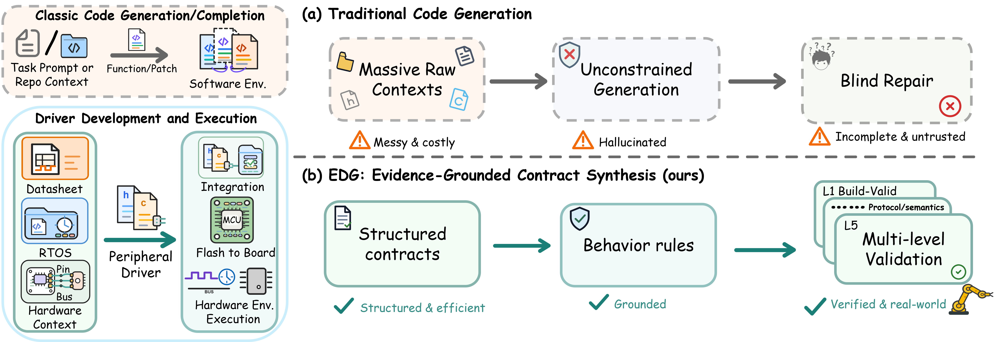
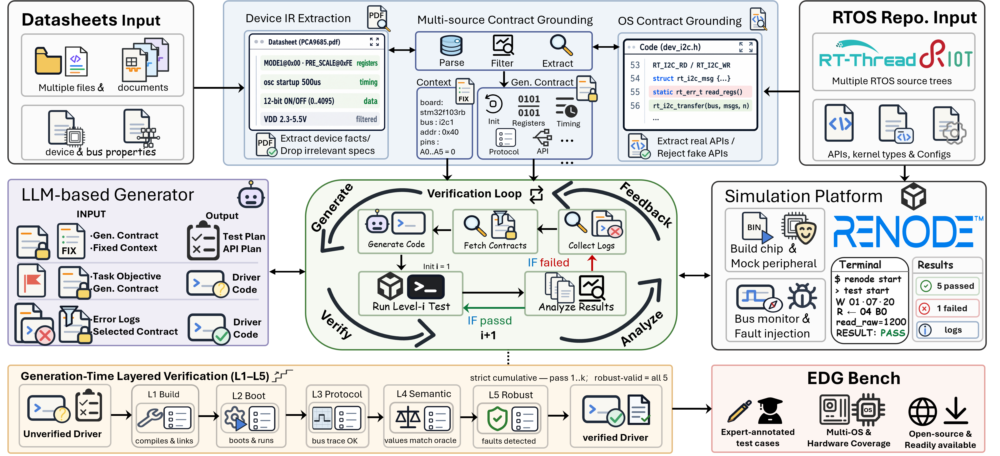

# EDG

**EDG** is an embedded-OS peripheral driver generation framework based on evidence-constrained contract synthesis. It extracts device behavior from datasheets, grounds required capabilities in RTOS repositories, generates native driver code, and repairs the result with build, boot, protocol, semantic, and robustness feedback.

This repository contains the EDG generation framework, the EDGBench benchmark data, and the L1-L5 evaluator used in the paper **Embedded-OS Peripheral Driver Generation**.



This project consists of three main components:

## Project Structure

```text
EDG/
├── data/          # EDGBench datasheets, fixed task packages, references, and RTOS manifest
├── drivergen/     # EDG generation pipeline
├── evaluation/    # L1-L5 build, boot, protocol, semantic, and robustness evaluator
├── assets/        # Paper figures used by this README
├── run_demo.py
├── run_with_evaluation.py
└── requirements.txt
```

## Components

### 1. EDGBench Data (`./data/`)

EDGBench contains 325 fixed generation tasks spanning 25 peripherals and 13 RTOS contexts. Each task package pins the datasheet, RTOS/platform context, bus binding, device attachment facts, and reference artifacts needed for reproducible generation and evaluation.

For dataset layout, RTOS source setup, and task-package format, see [Data Documentation](./data/README.md).

### 2. EDG Generation Framework (`./drivergen/`)

The generation pipeline builds evidence-backed Device IR from datasheets, derives RTOS Contracts from local RTOS source trees, freezes a synthesis and test plan, and generates driver plus evaluation adapter code.



For CLI usage, provider configuration, and generated artifacts, see [DriverGen Documentation](./drivergen/README.md).

### 3. EDGBench Evaluator (`./evaluation/`)

The evaluator checks generated drivers with a five-level ladder:

- L1 build-valid: firmware builds and links.
- L2 boot-valid: firmware boots and reaches the test harness.
- L3 protocol-valid: bus transactions match the device protocol.
- L4 semantic-valid: returned values match device semantics.
- L5 robust-valid: faults are detected or reported correctly.

For evaluator commands, simulator setup, and tool requirements, see [Evaluation Documentation](./evaluation/README.md).

## Quick Start

1. Install Python dependencies:

```bash
pip install -r requirements.txt
```

2. Download the RTOS source trees listed in [data/rtos/README.md](./data/rtos/README.md). The pipeline reads local repositories only; it does not clone them at runtime.

3. Configure an LLM provider, for example:

```bash
set OPENAI_API_KEY=...
```

4. List available task packages:

```bash
python -m drivergen list-task-packages
```

5. Run one generation task:

```bash
python -m drivergen run --combo freertos_stm32f103rb__at24c256__i2c1_polling --codegen --no-renode
```

6. Evaluate a generated bundle:

```bash
python -m evaluation.cli evaluate ^
  --device at24c256 ^
  --rtos freertos ^
  --driver-dir runs/<run_id>
```

## Requirements

- Python 3.10.20
- Python packages in `requirements.txt`: Docling, jsonschema, tree-sitter, and tree-sitter-c
- [Renode 1.16](https://renode.io/) as the simulator backend for L2-L5 checks
- [Arm GNU Toolchain](https://developer.arm.com/downloads/-/arm-gnu-toolchain-downloads) providing `arm-none-eabi-gcc`
- Local RTOS source trees listed in [data/rtos/README.md](./data/rtos/README.md)
